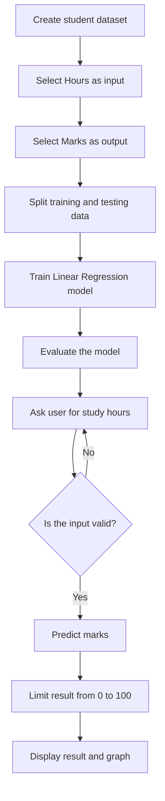
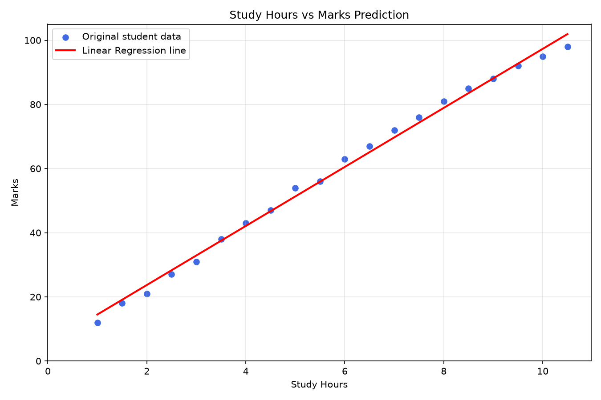

# Study Hours vs Marks Prediction

> A beginner-friendly machine learning project that predicts student marks from daily study hours by using Linear Regression.


## Table of Contents

- [Project Overview](#project-overview)
- [Problem Statement](#problem-statement)
- [Objectives](#objectives)
- [Features](#features)
- [Technology Used](#technology-used)
- [How the Project Works](#how-the-project-works)
- [Project Workflow](#project-workflow)
- [Folder Structure](#folder-structure)
- [Dataset](#dataset)
- [Model Evaluation](#model-evaluation)
- [Installation](#installation)
- [Running the Project](#running-the-project)
- [Example Output](#example-output)
- [Input Validation](#input-validation)
- [Graph](#graph)
- [Testing](#testing)
- [Common Problems and Solutions](#common-problems-and-solutions)
- [Limitations](#limitations)
- [Future Improvements](#future-improvements)
- [Viva Questions and Answers](#viva-questions-and-answers)

## Project Overview

This project uses machine learning to estimate a student's marks from the number of hours studied in one day.

The project is designed for beginners. It demonstrates the complete basic machine learning process:

1. Create a dataset.
2. Select the input and output columns.
3. Divide the data into training and testing parts.
4. Train a Linear Regression model.
5. Evaluate the model.
6. Accept study hours from the user.
7. Predict marks.
8. Create a graph.

This is an educational project. Its purpose is to explain machine learning clearly, not to make official academic decisions.

## Problem Statement

Students often want to understand whether increasing study time may improve their marks. This program studies the relationship between study hours and marks and uses that relationship to make a simple prediction.

## Objectives

- Learn the basic machine learning workflow.
- Understand features and targets.
- Train a Linear Regression model.
- Evaluate a regression model correctly.
- Accept and validate user input.
- Display the result in an understandable format.
- Visualize the dataset and regression line.

## Features

- Uses a small and readable student dataset.
- Uses realistic variation instead of a perfectly straight data pattern.
- Splits data into training and testing sets.
- Predicts marks with Linear Regression.
- Shows actual and predicted test values.
- Displays R-squared, Mean Absolute Error, and Mean Squared Error.
- Displays the equation learned by the model.
- Rejects empty, text, negative, and above-24-hour inputs.
- Keeps predicted marks between 0 and 100.
- Saves a clear graph inside the `images` folder.
- Includes unit tests for important functions.

## Technology Used

| Technology | Purpose |
|---|---|
| Python | Main programming language |
| Pandas | Creates and manages the dataset |
| Scikit-learn | Trains and evaluates the Linear Regression model |
| Matplotlib | Creates the study-hours and marks graph |
| unittest | Tests important program behavior |

## How the Project Works

### Input feature

`Hours` is the feature. A feature is the information given to the model.

### Target value

`Marks` is the target. A target is the value that the model learns to predict.

### Machine learning algorithm

The project uses **Linear Regression**. It tries to draw the best straight line through the data points.

The basic equation is:

```text
Predicted Marks = (Coefficient × Study Hours) + Intercept
```

- **Coefficient:** Approximate change in marks when study time increases by one hour.
- **Intercept:** Starting point of the prediction line.

## Project Workflow



## Folder Structure

```text
Study-Hours-Marks-Prediction/
│
├── images/
│   └── study_hours_marks_graph.png  # Graph created by the program
│
├── main.py                          # Main machine learning program
├── test_main.py                     # Unit tests for important functions
├── requirements.txt                 # Required Python libraries
├── .gitignore                       # Files Git should not upload
└── README.md                        # Complete project documentation
```

### Important files

| File | Purpose |
|---|---|
| `main.py` | Creates data, trains the model, evaluates it, accepts input, predicts marks, and creates the graph |
| `test_main.py` | Checks input validation, prediction range, dataset structure, and model measurements |
| `requirements.txt` | Lists the libraries required to run the project |
| `.gitignore` | Prevents virtual environments and temporary files from being uploaded |
| `README.md` | Explains installation, usage, workflow, testing, and limitations |

## Dataset

The dataset is written inside `create_student_dataset()` in `main.py`.

Example rows:

| Study Hours | Marks |
|---:|---:|
| 1.0 | 12 |
| 3.0 | 31 |
| 5.0 | 54 |
| 7.0 | 72 |
| 9.0 | 88 |
| 10.5 | 98 |

The values contain small differences because real student performance does not follow a perfectly exact formula.

## Model Evaluation

This is a regression project, so the program does not call the result “accuracy.” It uses regression measurements.

| Measurement | Simple meaning |
|---|---|
| R-squared | Shows how well the model follows the overall data pattern. A value closer to 1 is better. |
| Mean Absolute Error | Shows the average difference between actual and predicted marks. A smaller value is better. |
| Mean Squared Error | Gives a larger penalty to bigger prediction mistakes. A smaller value is better. |

The dataset is small, so these measurements are only useful for learning.

## Installation

### 1. Install required software

Install:

- [Python](https://www.python.org/downloads/) 3.11 or newer
- [Git](https://git-scm.com/downloads)
- [Visual Studio Code](https://code.visualstudio.com/) or another code editor

During Python installation on Windows, select **Add Python to PATH**.

### 2. Clone the project

```bash
git clone YOUR_GITHUB_REPOSITORY_URL
cd Study-Hours-Marks-Prediction
```

If the project is already on your computer, open its folder in a terminal.

### 3. Create a virtual environment

Windows PowerShell:

```powershell
python -m venv venv
```

### 4. Activate the virtual environment

Windows PowerShell:

```powershell
.\venv\Scripts\Activate.ps1
```

Windows Command Prompt:

```bat
venv\Scripts\activate
```

macOS or Linux:

```bash
source venv/bin/activate
```

### 5. Install the libraries

```bash
python -m pip install -r requirements.txt
```

No environment variables or API keys are required.

## Running the Project

Run:

```bash
python main.py
```

The program will:

1. Train the model.
2. Display model evaluation results.
3. Display the learned equation.
4. Ask for study hours.
5. Display predicted marks.
6. Save and open the graph.

## Example Output

```text
=======================================================
STUDY HOURS VS MARKS PREDICTION
=======================================================

Model trained successfully.

Model evaluation:
R-squared score       : 0.99...
Mean Absolute Error  : ... marks
Mean Squared Error   : ...

Enter study hours (0-24): 5

Predicted marks for 5 study hours: 51.30 out of 100

Graph saved at: images\study_hours_marks_graph.png
```

The exact decimal values may depend on the installed library version.

## Input Validation

| Entered value | Program response |
|---|---|
| `5` | Accepted |
| `5.5` | Accepted |
| Empty input | Requests input again |
| `five` | Explains that a number is required |
| `-2` | Explains that hours cannot be negative |
| `25` | Explains that hours cannot be above 24 |

## Graph

The program creates the following graph:



- Blue dots represent the original student data.
- The red line represents the model's prediction pattern.

## Testing

Run all tests:

```bash
python -m unittest -v
```

The tests check:

- Dataset columns and size.
- Valid whole-number and decimal inputs.
- Empty, text, negative, and above-24-hour inputs.
- Prediction results remain between 0 and 100.
- Evaluation measurements are created correctly.

## Common Problems and Solutions

### Python is not recognized

Reinstall Python and select **Add Python to PATH** during installation.

### ModuleNotFoundError

Activate the virtual environment and install the requirements:

```bash
python -m pip install -r requirements.txt
```

### PowerShell does not activate the virtual environment

Run PowerShell as your normal user and use:

```powershell
Set-ExecutionPolicy -Scope Process -ExecutionPolicy Bypass
.\venv\Scripts\Activate.ps1
```

This changes the policy only for the current PowerShell window.

### Graph window does not open

Check the saved image:

```text
images/study_hours_marks_graph.png
```

The image is saved even when the graph window cannot open.

### Feature-name warning

The model is trained with the `Hours` column. Predictions must also use a DataFrame containing the same `Hours` column. The current program already follows this rule.

## Limitations

- The dataset contains only a small number of sample records.
- The data is manually created and is not collected from real students.
- Study hours alone cannot fully explain student marks.
- Sleep, attendance, teaching quality, health, and previous knowledge are not included.
- Predictions outside the dataset range are less reliable.
- The project should not be used for official student evaluation.

## Future Improvements

- Load a larger real dataset from a CSV file.
- Add attendance, sleep, assignment score, and previous marks.
- Compare Linear Regression with other regression algorithms.
- Create a beginner-friendly web interface with Streamlit.
- Save trained models for later use.
- Add more graphs for model analysis.

## Viva Questions and Answers

### 1. Why is Linear Regression used?

Marks are numeric values, and the project studies the relationship between study hours and marks. Linear Regression is simple and suitable for learning this relationship.

### 2. What is a feature?

A feature is the input given to the model. Here, `Hours` is the feature.

### 3. What is a target?

A target is the value the model predicts. Here, `Marks` is the target.

### 4. Why is the data split?

The training data teaches the model. The testing data checks the model using records it did not use for learning.

### 5. What does `random_state=42` do?

It keeps the data split the same each time, which makes testing and explanation easier.

### 6. Why is accuracy not displayed?

Accuracy is mainly used for classification. This project predicts a numeric value, so regression measurements are more suitable.

### 7. Why are predictions limited to 0 and 100?

Student marks cannot normally be less than 0 or greater than 100.

### 8. Is this model completely reliable?

No. It is a learning project with a small sample dataset and only one input feature.

## Author

Created as a beginner-friendly machine learning project.

## References

- [Python Documentation](https://docs.python.org/3/)
- [Pandas Documentation](https://pandas.pydata.org/docs/)
- [Scikit-learn Linear Regression](https://scikit-learn.org/stable/modules/generated/sklearn.linear_model.LinearRegression.html)
- [Matplotlib Documentation](https://matplotlib.org/stable/)
